# Build Data Pipelines with Apache Spark Declarative Pipelines
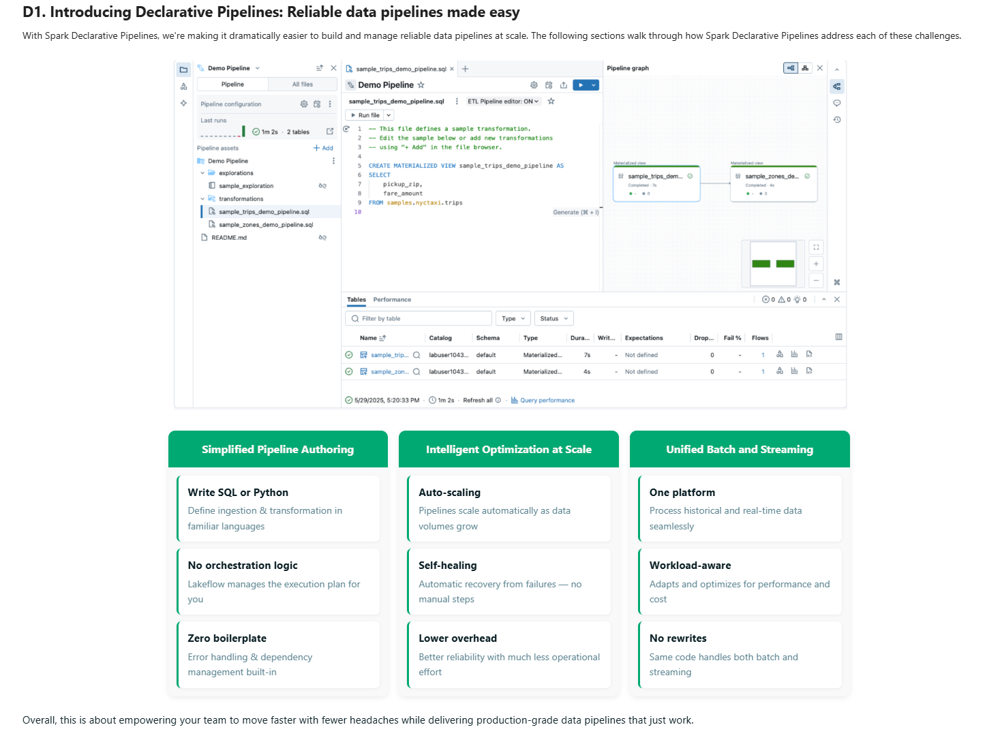
## Demo course setup
- review pipeline logic
- turn on the ETL multi-file pipeline editor setting
- create new > ETL Pipeline
- set default catalog and schema
- name the pipeline
- start w/ sample sql code will give you a sample structure and code files
- you could add existing queires with add existing assets from Git or workspace
- pipeline does need a parent/root folder, with all assets contained within

# Lecture 1 - Course Project and Dataset Types Overview
in the course we'll simplify a JSON sourced pipeline with ASDP
Step 1 Orders Flow: ingest, transfor, and summarize Orders:
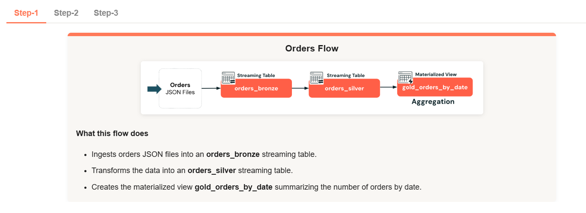

Step 2 Status Flow: ingest and transform the status data, then join the order and status for final full order materialized view along with filtered views for cancelled and delivered orders
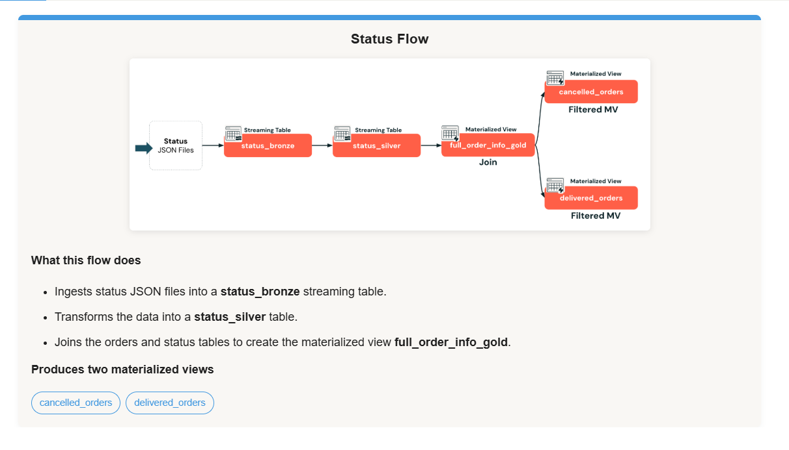

Step 3 Customer Flow: ingest and clean customers data, then perform CDC to trad data changes on the silver custoemrs table
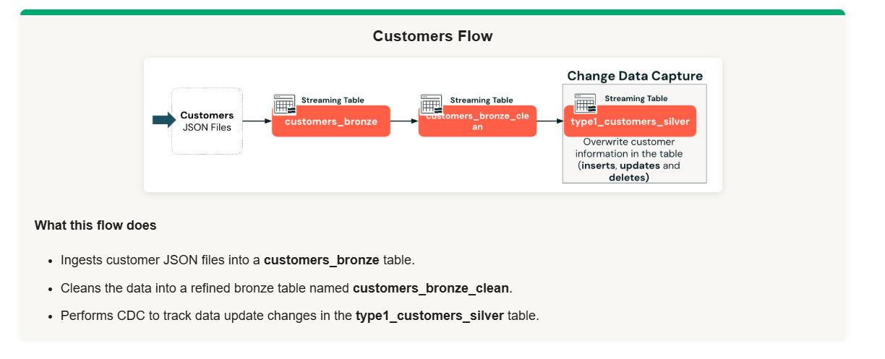

## Dataset types
- **Streaming Tables** - a table with support for streaming or incremental data **only processing new data**
    - exactly once processing
    - must use FROM STREAM read_files()
    - data is always appended
    - leverages the auto loader
    - no duplicate reads
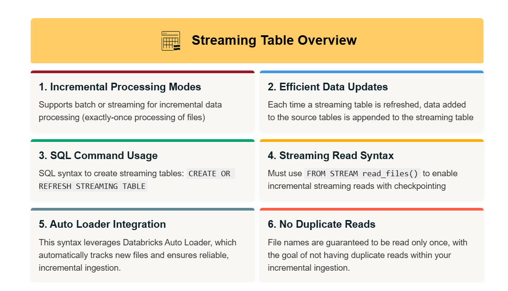
- **materialized views** - table as a query where records are only process as required to return **current state data**. good for tasks like transformations, aggregations, pre-computing slow queries, and frequently used computations
    - can be used anywhere in pipeline, not ONLY the gold layer
    - incrementally updated
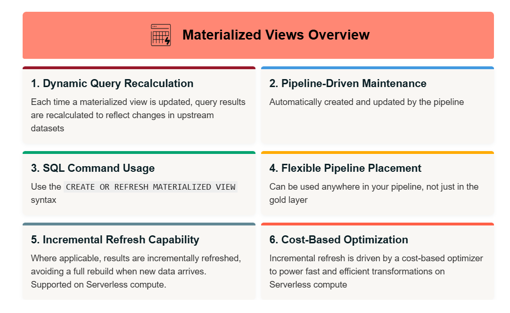

- **Views** - no physical data. reruns query every time you need to access the data
    - TEMP VIEWS only exist during a pipeline run, cannot be registered in UC
    - VIEWS can be registered to UC
    - neither can have streaming queries or used as a streaming source
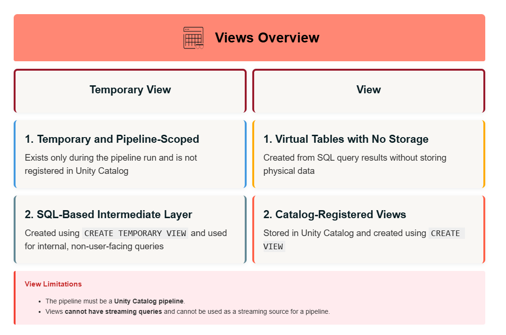

See Load data with Apache Spark™ Declarative Pipelines for full reference on streaming ingestion patterns. https://docs.databricks.com/aws/en/dlt/load

**example 1: Bronze Streaming Table**

CREATE OR REFRESH STREAMING TABLE 1_bronze_db.orders_bronze AS  
SELECT  
  *,  
  current_timestamp() AS processing_time,  
  _metadata.file_name AS source_file  
FROM STREAM read_files(  
  "{{ source_path }}/orders",  
    format => 'JSON');  

**Example 2: Silver Streaming Table** note the FROM STREAM
CREATE OR REFRESH STREAMING TABLE 2_silver_db.orders_silver AS  
SELECT  
  order_id,  
  timestamp(order_timestamp) AS order_timestamp,  
  customer_id,  
  notifications  
FROM STREAM 1_bronze_db.orders_bronze;  

**Example 3: Silver or Gold Materialized View** note the lack of STREAM option in from clause
CREATE OR REFRESH MATERIALIZED VIEW 3_gold_db.gold_orders_by_date AS  
SELECT  
  date(order_timestamp) AS order_date,  
  count(*) AS total_daily_orders  
FROM 2_silver_db.orders_silver  
GROUP BY date(order_timestamp);  

## Updates since DLT to SDP change
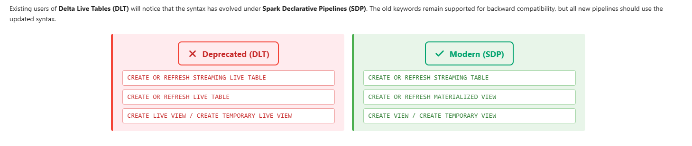

Pipelines are automatically dependant:
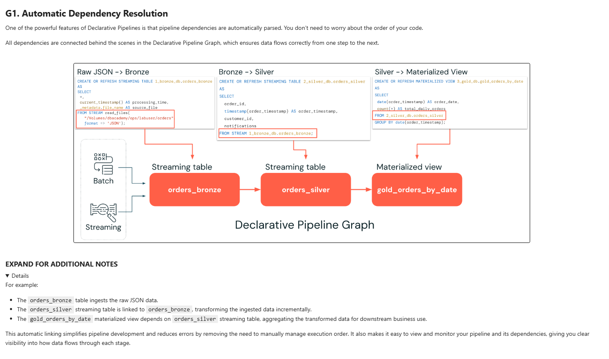

---

# Lecture 2 - Simplified Pipeline Development and Common Pipeline Settings
## Simplified Development
- Multi-File Editor allows you to organize a full pipeline into many files and directories, rather than the old way of doing things with a single SQL script
- now you can write pipelines with .sql AND .py files OR notebooks with both
- documentation: https://docs.databricks.com/aws/en/dlt/dlt-multi-file-editor
- edit pipeline settings directly in the editor
    - compute
    - code assets
    - configuration parameters

pipeline parameters are effectively task parameters for a pipeline. you could also set these in the task, but easier to develop and test with them in the editor

## Demo on building a pipeline
I did a bunch of work, trying to build my own retail streaming CDC pipeline here: https://dbc-26b5f9a9-0593.cloud.databricks.com/editor/files/2628630834171352?contextId=pipeline%3Add28d1ad-87e3-4731-9123-29f2e577291e&o=7474644609179013

 ---

 # Lecture 3 - Ensure Data Quality with Expectations
Expectations are a way to apply data quality rules in a declarative way during the ETL pipeline.  
syntax is as follows:  
CONSTRAINT constraint_name  
EXPECT (column_condition)  
[ON VIOLATION action]  

## Three Violation Actions
1. WARN
    - expectation only
    - invalid rows are still written to target
    - logs include counts of valid vs. invalid records
2. DROP
    - ON VIOLATION DROP ROW
    - invalid rows are dropped
    - cound of dropped rows are logged

3. FAIL
    - ON VIOLATION FAIL UPDATE
    - single flow fails
    - manual intervention required to resolve

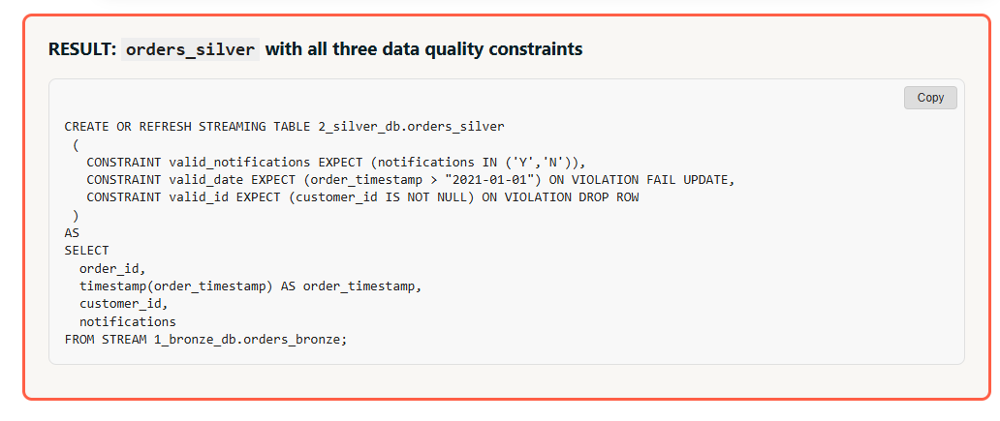

As of Q2 2025, any materialized views that use expectations will always be fully refreshed during pipeline runs.

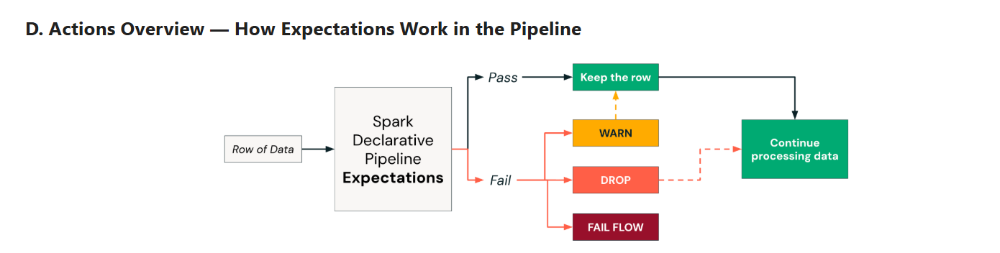

---

# Lecture 4 - Streaming Joins and Deploying Pipelines to Production
there a 3 different types of streaming joins:
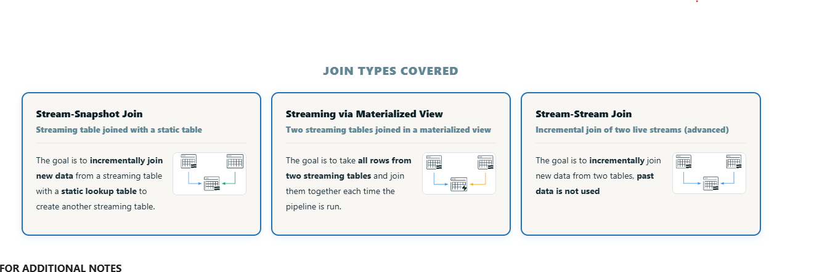

1. stream-snapshot - joining a streaming table to a static lookup table. example - lookup a country code or customer segment in a join to create a new streaming table with the enriched data
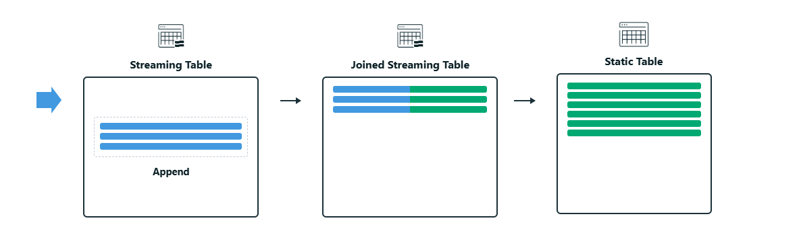
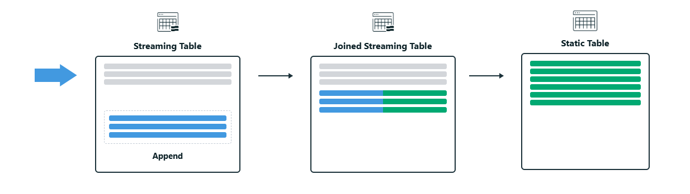

2. join streaming tables w/ materialized view - you can use a materialized view to join to individual streaming tables. used when both inputs are continuously changing. example one stream contains customer activity and another contains product updates. incrementally refreshes all new rows from both tables. timing depending on pipeline config
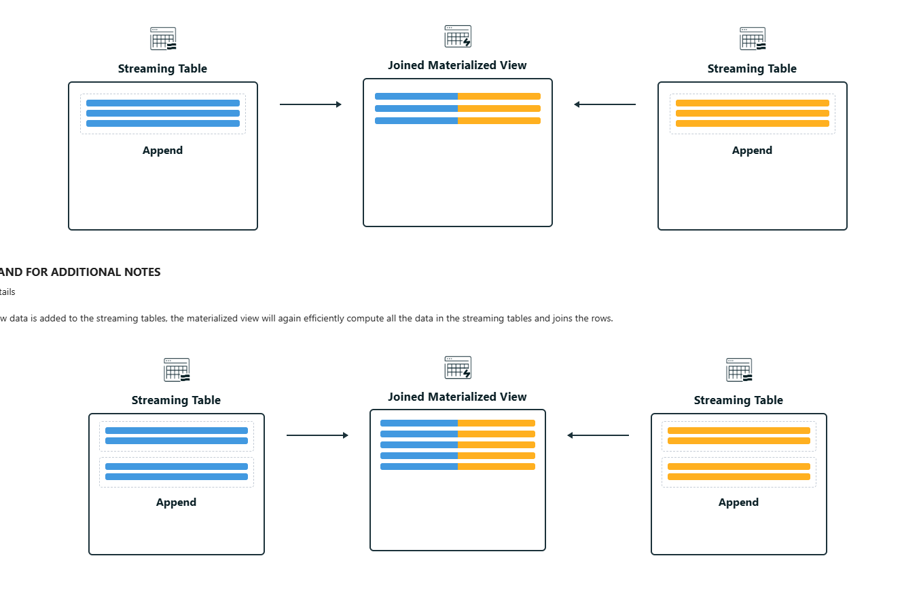

3. stream-stream joins - stream-stream joins only keep new data. this is good for use cases where closely timed events need to be detected, such as clicktreams and impressions. this is the most advanced, because they often involve more advanced streaming concepts
- advanced documentation: https://docs.databricks.com/gcp/en/transform/join#stream-stream-joins
- optimize statefule processing with watermarks: https://docs.databricks.com/aws/en/dlt/stateful-processing

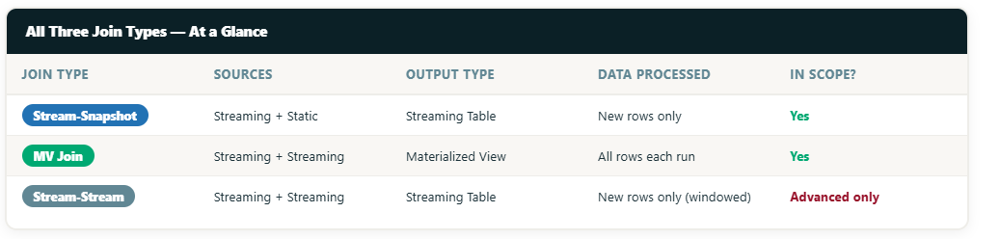

## Deployment
use the scheduler and monitoring features to deploy pipelines. you can also orchestrate a pipeline with a job. 
recommended to publish the pipeline event log as a delta table for further auditing and monitoring

additional properties available:
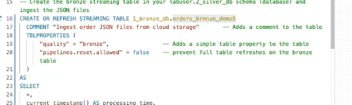

when switching to "production", you must decide on a channel:
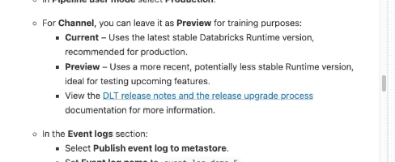

Then you can publish event logs:
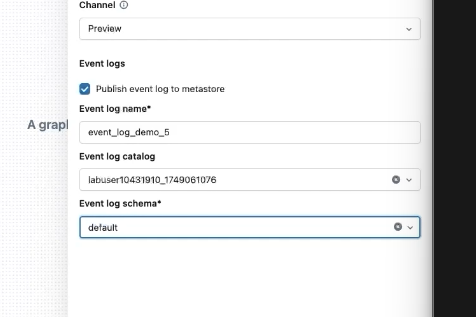

in the demo, he added more files, and reran the pipeline. everything runs incrementally. existing data isn't touched, unless you were doing CDC to drop rows

---

# Lecture 5 - Change Data Capture Overview
SCD Type 1 – Overwrites existing data (no history tracking)
SCD Type 2 – Tracks historical changes by storing previous versions of records

SCD Type 1 
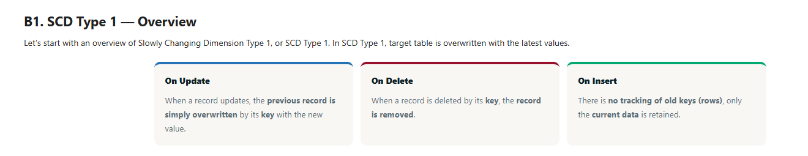

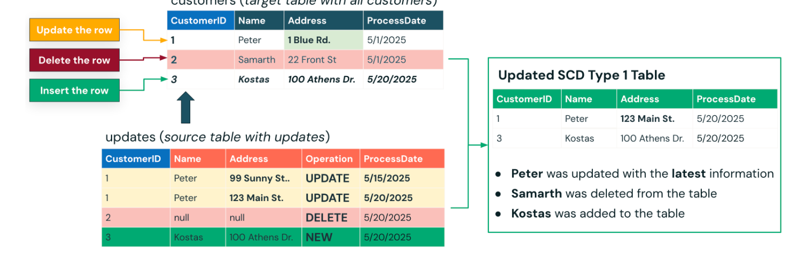

use when you only need current data

SCD Type 2
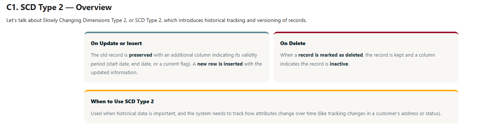

use when you need to track changes over time

effective dates are used to track data validity over time:
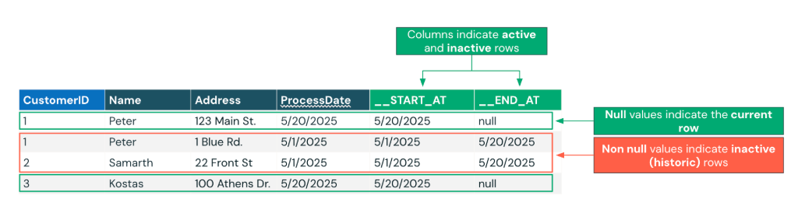

## Demo of auto CDC
try this myself. CDC on customers