# Lecture 1 - Intro to Data Engineering
source: https://customer-academy.databricks.com/learn/learning-plans/10/data-engineer-learning-plan/courses/1365/deploy-workloads-with-lakeflow-jobs/lessons/63275:3536/introduction-to-data-engineering-in-databricks

This Course focuses on Lakeflow Jobs, the orchestration component of Databricks
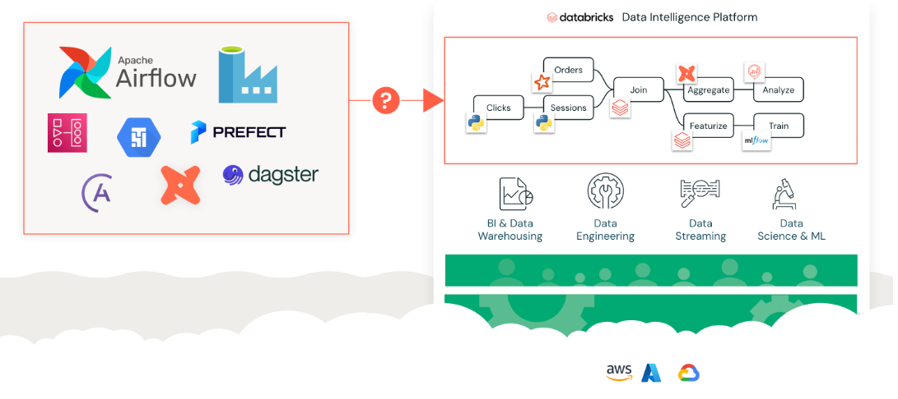
Lakeflow Jobs keeps things in one place, reduces cost, and reduces complexity. all managed by the same vendor
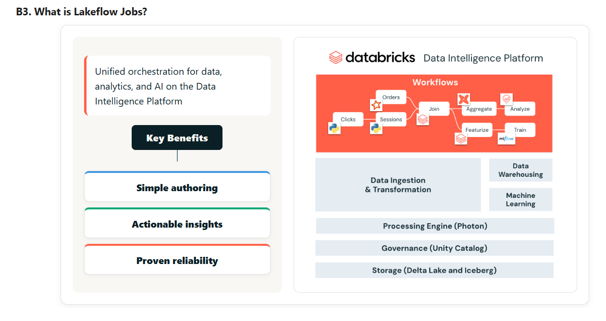

### Lakeflow Jobs architecture:
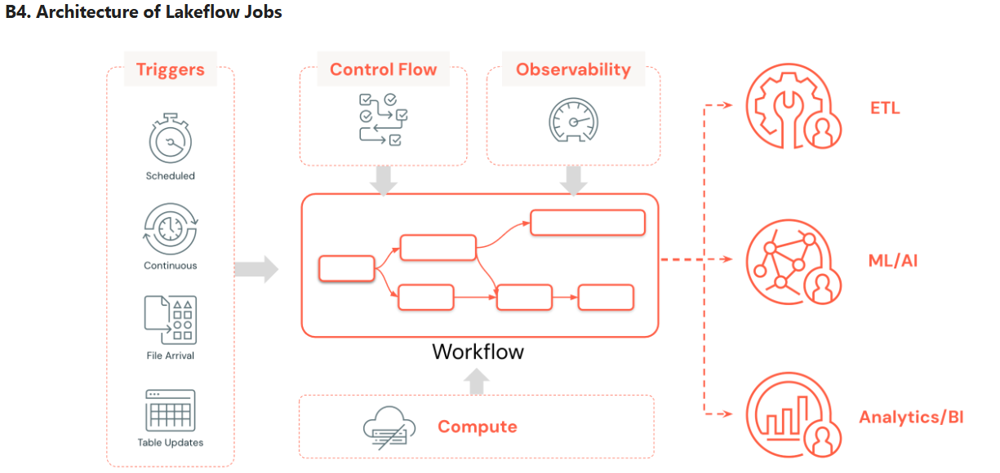

# Lecture 2 - Lakeflow Jobs core components
## Jobs and Tasks
### Jobs
- primary resource for scheduling, coordinating, and running operations
- Jobs are the collective component, they require at least one task
- jobs can include other jobs

### Tasks
- single unit of work with in a job
- associated with Notebooks, Scripts, Queries, Other Jobs, and more

### Task Configuration Options
- each task accepts configurations specific to the job it lives in
- code path, libraries, parameters, notifications, compute object, dependancies

### Orchestration
supports many different control flows
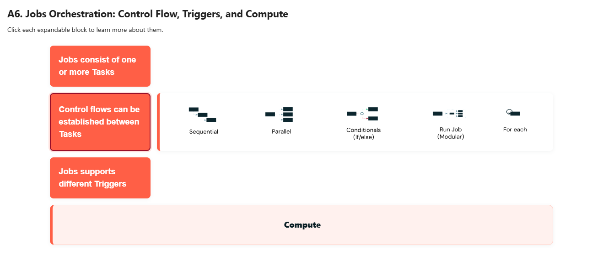

different triggers:
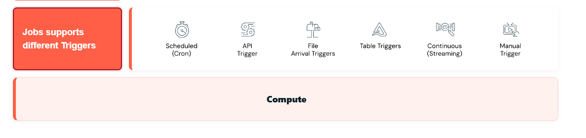

and different compute options:
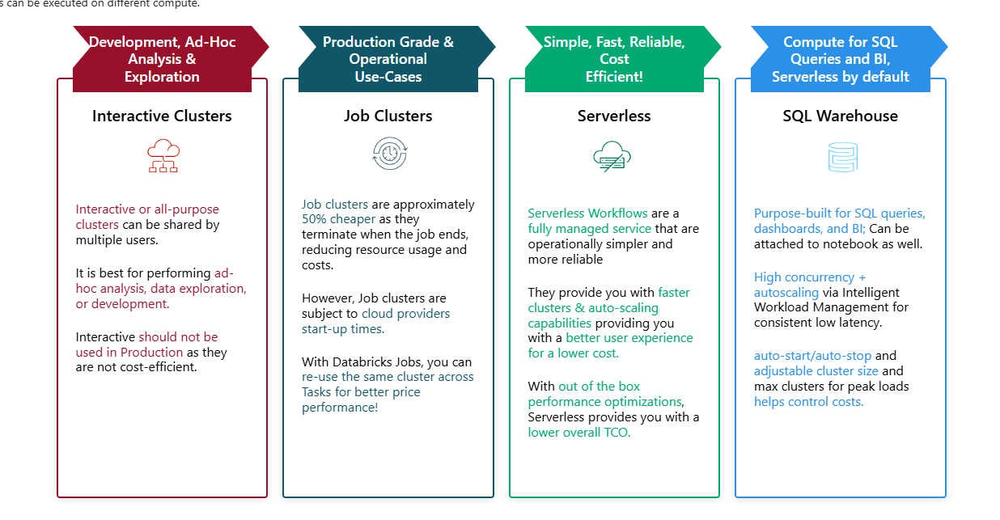

### Compute overview
- Interactive Clusters can be shared by multiple users and are best for ad-hoc analysis, data exploration, or development. However, they should not be used in production as they are not cost-efficient.

- Job Clusters are approximately 50% cheaper as they terminate when the job ends, reducing resource usage and costs. They're ideal for production workloads, though they are subject to cloud provider start-up times. With Databricks Jobs, you can reuse the same cluster across tasks for better price performance.

- Serverless provides a fully managed service that is operationally simpler and more reliable. It offers faster clusters and auto-scaling capabilities, providing better user experience for lower cost. With out-of-the-box performance optimizations, Serverless provides lower overall TCO.

- SQL Warehouse is purpose-built for SQL queries, dashboards, and BI, and is serverless by default. It offers high concurrency and autoscaling via Intelligent Workload Management, with auto-start/auto-stop and adjustable cluster sizing to help control costs.

# Lecture 3 - Creating and Scheduling Jobs
3 major categories of task configuration options:
1. Parameters & Dynamic Value References - foundational to robust, flexible workflows. can be set at the job level or the task level. note that the job parameter values will override task parameter values if there is a conflict.
2. Retires - first line of defense of unexpected or transient falues. you can set retry parameters at the job and task level.
3. Notification alerts - keep team informed. you can set notifications at the job and task level too

## Parameters
- task parameters are key value pairs or JSON arrays, specific to individual tasks
- Jobs parameters are defined at the job and automatically propogate to all tasks
- common usage practices:
    1. conditional execution - get conditions from data and then determine how to execute rest of the workflow
    2. looping - control iteration counts, define arrays for for-each loops, and manage complex processing scenarios
    3. context passing - shar information between tasks

accessing parameters programatically:
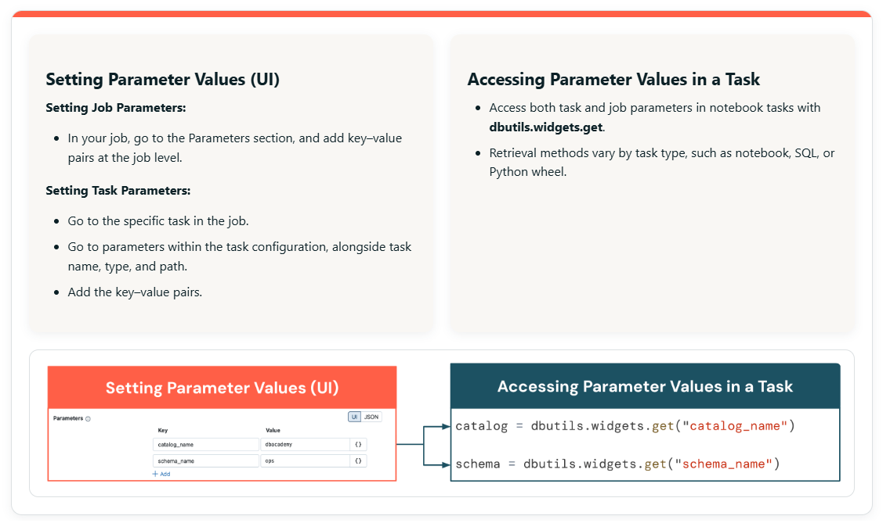

set values programatically:
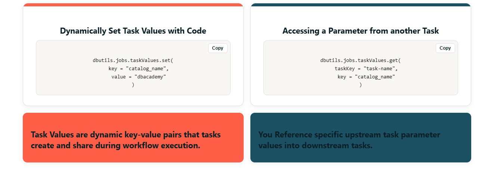

## Dynamic Value References
allows referencing values at runtime, when you set the parameter value:
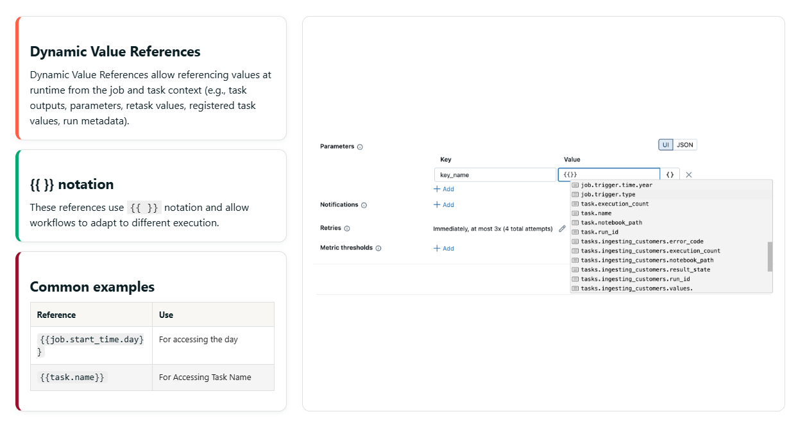

typcial references:
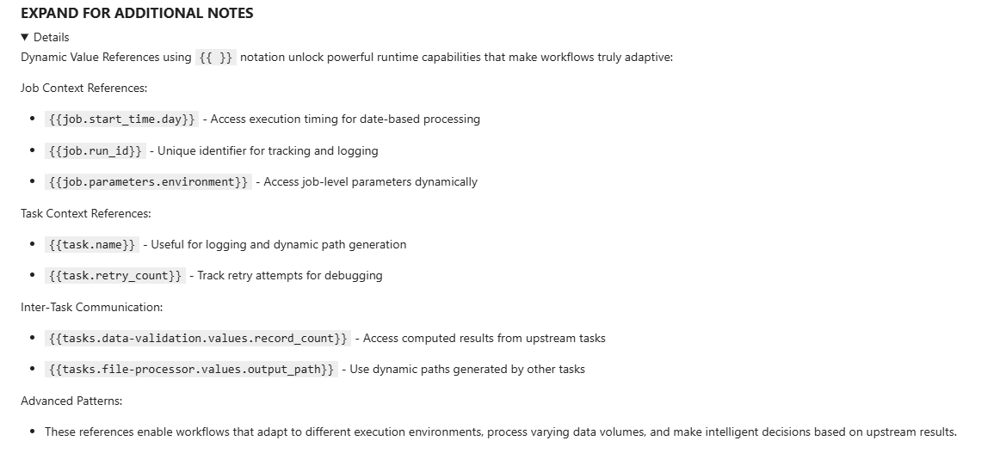

## Notifications:
Multiple Destinations: Support for Emails, Microsoft Teams, PagerDuty, Slack, and Webhooks means you can integrate with your existing operational tools and communication patterns. Different teams might prefer different channels - developers might want Slack notifications while operations teams prefer PagerDuty integration.

Per-Task Customization: Each task in a job can have completely different notification configurations. Your data ingestion tasks might send alerts to the data engineering team, while your reporting tasks notify business stakeholders.

Advanced Trigger Conditions: Beyond simple success/failure, you can configure notifications for:

Late Jobs: Duration threshold warnings and timeout alerts help you catch performance degradation early

Streaming Backlog: Critical for streaming workloads where falling behind can cascade into larger issues

Custom Conditions: Webhook integrations allow complex custom logic for notification decisions

Lifecycle Notifications: Jobs can trigger notifications when tasks begin (useful for long-running processes), complete successfully (confirmation of completion), or fail (immediate response required).

## Retry Policies
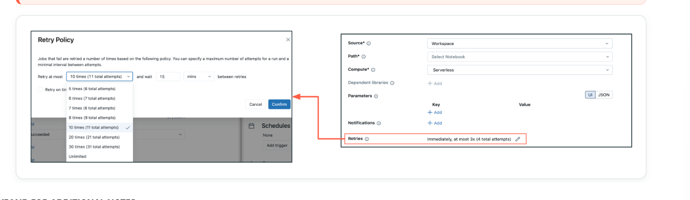

## Triggers
- time based
- continuous
- file arrival events
- manual triggers

**Scheduled triggers** are the backbone of most production data workflows, providing reliable, time-based execution:

 - **UI-Based Scheduling**: The Databricks interface provides intuitive scheduling options for common patterns - hourly, daily, weekly, monthly. This is perfect for business users and reduces the learning curve for cron syntax.
- **Cron Expression Power**: For more complex timing requirements, full cron expression support enables sophisticated schedules like "every 15 minutes during business hours" or "first Monday of each month."
- **Use Case Patterns**:
    - Daily ETL: Process yesterday's data every morning at 6 AM
    - Weekly Reports: Generate executive dashboards every Monday morning
    - Monthly Aggregations: Calculate monthly KPIs on the first day of each month
    - Hourly Streaming Checkpoints: Regular maintenance for streaming jobs
**Timezone Considerations**: Always specify the appropriate timezone for your business context, especially for organizations operating across multiple regions.
**File arrival triggers** represent a paradigm shift from time-based to event-driven processing, enabling immediate response to data availability:
- **Storage Platform Support**: AWS S3, Azure Storage, Google Cloud Storage, and Databricks Volumes.
- **Event-Driven Architecture**: Processing begins immediately when data becomes available, rather than waiting for the next scheduled execution.
- **Real-World Scenarios**:
    - Partner Data Feeds: Process files as soon as external partners upload them
    - IoT Data Processing: Handle sensor data files uploaded irregularly throughout the day
    - Financial Data: Process trading data files that arrive at unpredictable intervals
    - Log File Processing: Handle application logs uploaded by various systems
**Pattern Matching**: Configure file pattern matching to process only relevant files and ignore temporary or incomplete uploads.
**Continuous triggers** are designed specifically for workloads that need to maintain constant processing:
- **Automatic Restart Logic**: Built-in retry logic automatically managed by Databricks ensures that streaming jobs maintain continuity even through transient failures.
- **Resource Management**: Continuous jobs are automatically managed to prevent resource leaks and ensure optimal cluster utilization over extended periods.
- **Streaming Use Cases**:
    - Real-time Analytics: Continuous processing of clickstream data for real-time dashboards
    - Fraud Detection: Always-on processing of transaction streams for immediate fraud identification
    - IoT Processing: Continuous ingestion and processing of sensor data streams
    - Change Data Capture: Real-time processing of database change streams
**Monitoring Considerations**: Continuous jobs require different monitoring approaches since they are designed to run indefinitely rather than complete discrete tasks.
**Manual triggers** provide essential flexibility for development, testing, and ad-hoc processing scenarios:

- **Execution Options**:
    - UI Execution: "Run now" for immediate execution with current settings
    - Parameterized Execution: "Run now with different settings" allows runtime parameter overrides
    - Programmatic Execution: API, CLI, SDK, and Databricks Asset Bundles enable integration with external systems
**Development Workflow**: Manual triggers are essential during development for testing job logic, debugging issues, and validating changes before implementing automated triggers.
**Operational Use Cases**:
- Backfill Processing: Handle historical data processing outside normal schedules
- Emergency Processing: Respond to urgent business needs that can't wait for scheduled execution
- Data Recovery: Reprocess specific time periods after resolving data quality issues
- Testing and Validation: Verify job behavior in production environments before enabling automation
**Table Update Trigger** - a new trigger type in Databricks Lakeflow Jobs.
- It automatically starts a job whenever specified source tables are updated.
- This means we no longer rely on manual or cron-based schedules. Instead, jobs run in real time — as soon as new data lands — which improves freshness and reduces wasted compute.
- It works by monitoring one or more tables for any data change — such as insert, update, delete, or merge.
- You can configure it easily by selecting the ‘Table update’ option within job triggers, and then listing the tables you want to watch.

## New table update Trigger configs
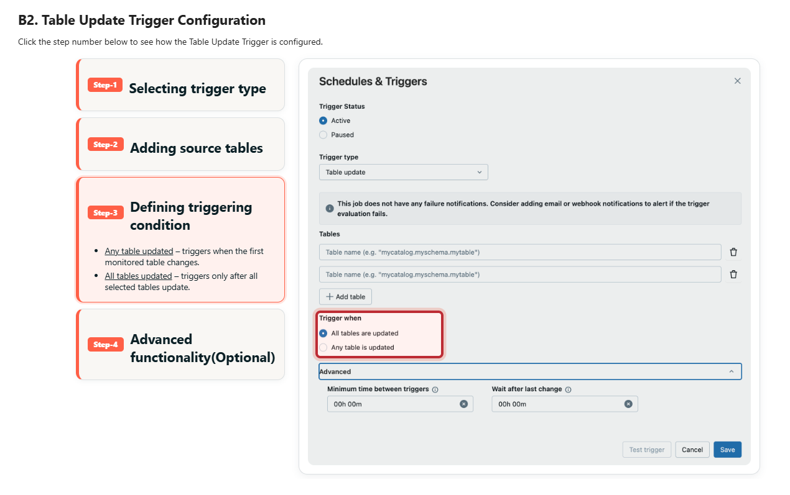

## Demo on building dynamic workloads
- to build an easy to read, dynamic workflow, you can use a job
- break each step of the workflow into their own notebooks
- then make downstream tasks dependant on upstream tasks
- some tasks might not even run. to set these dependancies, set to "none failed"
- you can even use generic summary tasks, and then use a "for each" task to perform that summary on specific values. example - summarize for each state, but use the task to only summarize for NY, CA, and VA. you can even do these concurrently in the task config
- task monitoring will show each "for" loop it's working on

---

# Lecture 4 - Handling Task Failures and Monitoring Jobs Performance
for targeted recovery, you can rerun a failed task only. you can deploy targeted fixes for:
1. configuration fixes
2. resource adjustments
3. code updates
4. data quality issues
this is a major cost savings capability for large jobs

You get a full audit history on repaired runs. 

Systems tables help monitor:
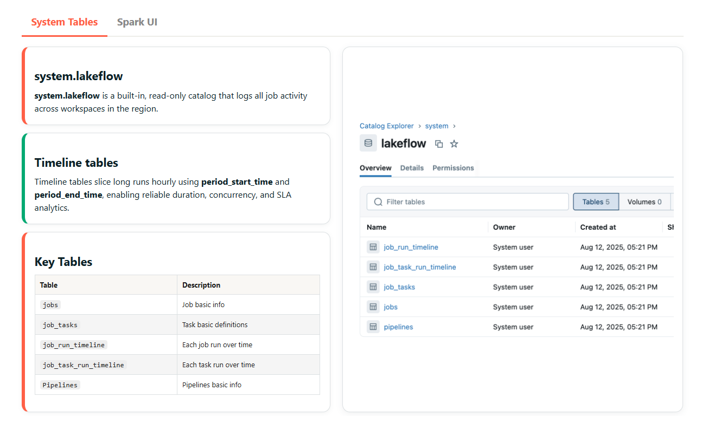

you can also use the Spark UI
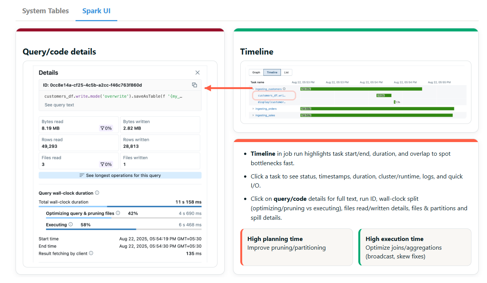

## Demo - monitoring and repairing tasks
- one cell in a notbook in step 6 contains bad code. "customer" being used when "customer_name" is the correct variable name
- view error in the job run
- go back to the notebook. fix the code. repair task. use the same parameters
- view run to see the repair status

---

# Lecture 5 - Lakeflow Jobs in Prodcution and Best Practices
- select the right compute
- make things as modulare as possible
- version control everything
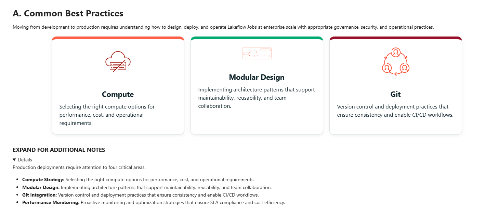

Notes on Compute:
- **Interactive Clusters** are ideal for development and ad-hoc analysis but present significant challenges for production use:
    - **Cost Issues**: Interactive clusters remain running even when not executing jobs, leading to unnecessary costs
    - **Limited Scalability**: Shared resources can create contention and performance unpredictability
    - **Availability Concerns**: Multiple users sharing clusters can cause resource conflicts and job delays
- **Job Clusters** offer better production characteristics:
    - **Cost Efficiency**: Clusters terminate when jobs complete, eliminating idle resource costs
    - **Dedicated Resources**: Each job gets dedicated compute resources, ensuring predictable performance
    - **Startup Latency**: Cloud provider startup times can delay job execution, requiring consideration in SLA planning
    - **Maintenance Overhead**: Requires more configuration and management compared to serverless options
- **Serverless compute** represents the optimal choice for most production workloads because it provides operational simplicity, performance optimization, reliability and speed, and cloud independence.

pricing structure:
**Classic**:
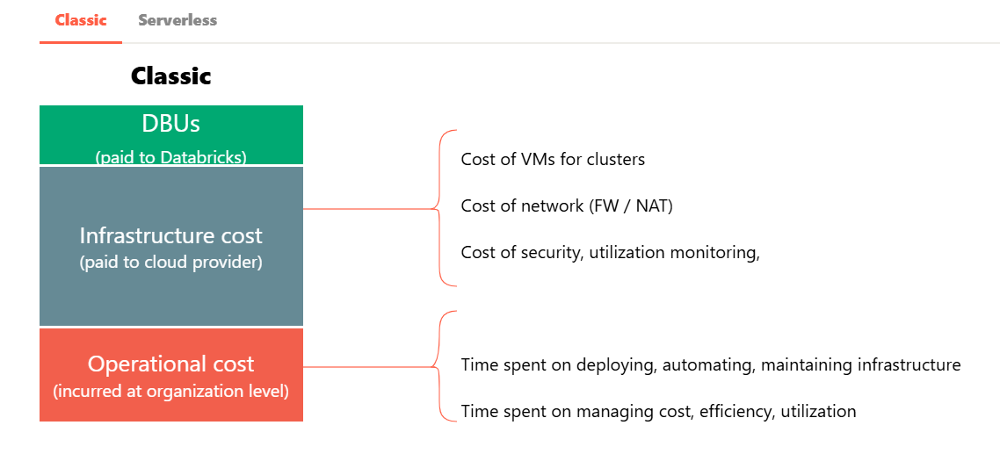

**Serverless**:
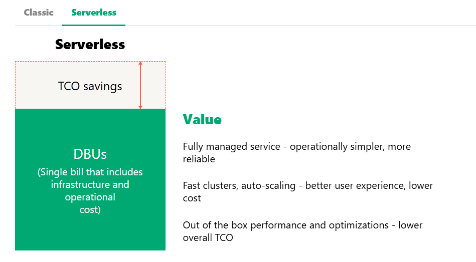

The traditional pricing model involves multiple cost components:

- **Direct Costs**: DBUs paid to Databricks plus infrastructure costs paid directly to cloud providers (VMs, networking, security services).
- **Operational Overhead**: Often overlooked but significant costs including time spent on infrastructure deployment, automation development, maintenance activities, cost monitoring, and efficiency optimization.
- **Hidden Complexity**: Managing multiple billing relationships, optimizing across different cost categories, and maintaining expertise in cloud infrastructure management.
Serverless fundamentally simplifies the cost model:
- **Unified Billing**: Single DBU price that includes infrastructure and operational costs, eliminating the need to manage multiple vendor relationships and cost optimization strategies.
- **Value Proposition**: The fully managed service provides operational simplicity and reliability improvements that often justify higher per-unit costs through reduced operational overhead.
- **Performance Benefits**: Auto-scaling capabilities and out-of-the-box optimizations often deliver better performance at lower total cost than self-managed alternatives.
- **TCO Advantages**: When you factor in operational overhead, the total cost of ownership is typically lower with serverless, especially for organizations without dedicated platform engineering teams.

## Modularity Overview
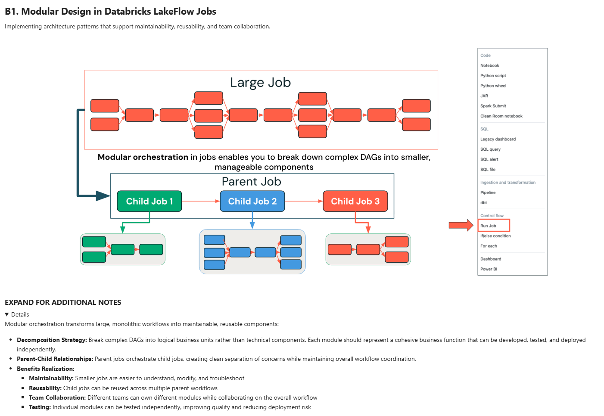

## Git Overview and Config:
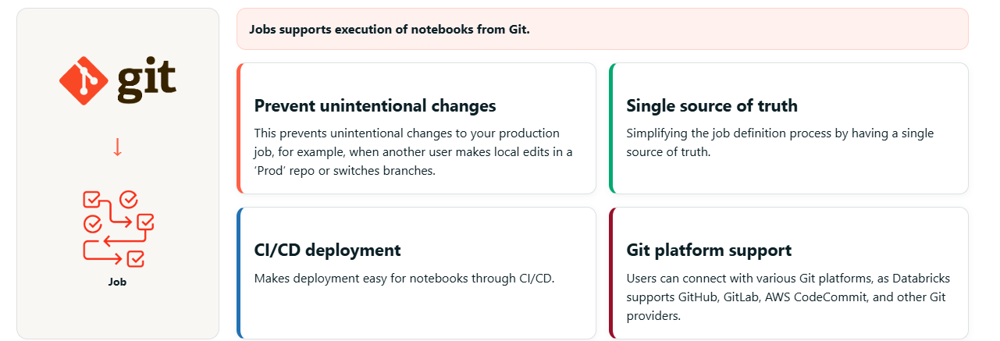

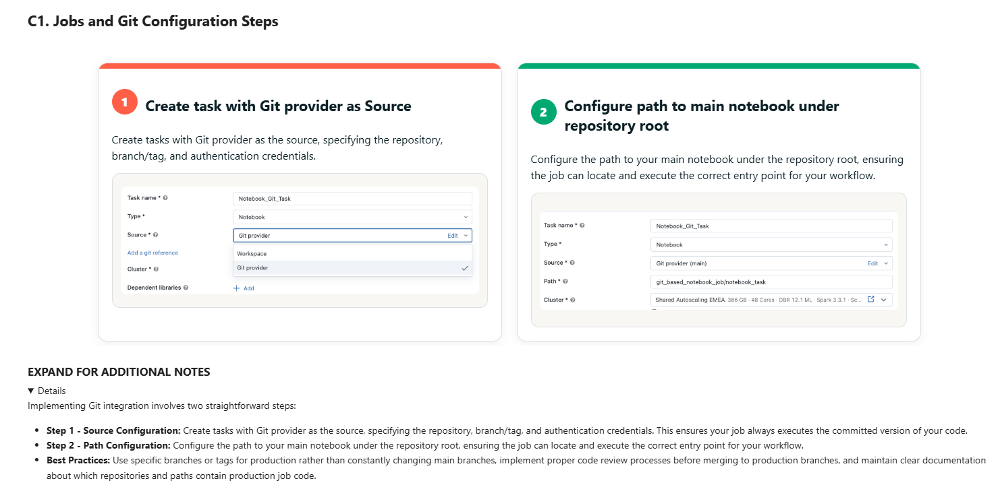

## Summary
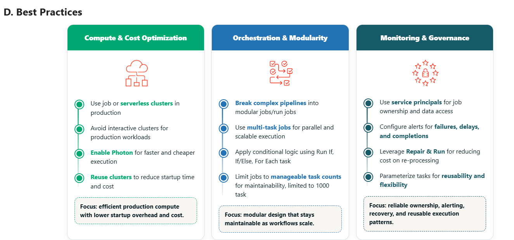

**Compute & Cost Optimization Practices**:

- **Production Compute**: Always use job clusters or serverless compute in production environments to ensure cost efficiency and resource isolation
- **Interactive Cluster Avoidance**: Reserve interactive clusters strictly for development and ad-hoc analysis to prevent production cost overruns and resource conflicts
- **Photon Enablement**: Enable Photon acceleration across all eligible workloads for significant performance improvements and cost reductions
- **Cluster Reuse**: Design workflows to reuse clusters across tasks when possible, reducing startup overhead and improving cost efficiency

**Orchestration & Modularity Practices**:

- **Modular Architecture**: Break complex pipelines into logical, maintainable modules using the run job task pattern for better maintainability and team collaboration
- **Multi-Task Design**: Leverage multi-task jobs for parallel execution and improved resource utilization while maintaining workflow clarity
- **Advanced Logic**: Implement sophisticated business logic using Run If, If/Else, and For Each tasks to handle complex real-world scenarios
- **Task Limitations**: Keep individual jobs under 1000 tasks to maintain manageability and performance, using modular design to handle larger workflows

**Monitoring & Governance Practices**:

- **Service Principal Usage**: Use service principals rather than personal accounts for job ownership and data access to ensure continuity and proper access control
- **Comprehensive Alerting**: Configure alerts for failures, delays, and completions with appropriate escalation and notification strategies
- **Recovery Optimization**: Leverage Repair & Run capabilities to minimize costs and recovery time when handling failures
- **Parameterization**: Design tasks with proper parameterization for maximum reusability and flexibility across environments and use cases