# Lecture 1 - Introduction to Software Engineering (SWE) Best Practices
use SWE best practices to build reliable data pipelines

Coding:
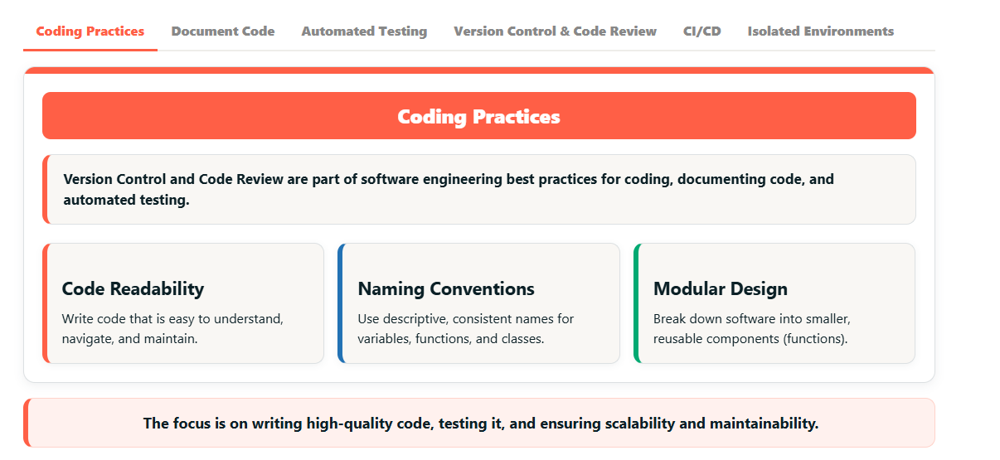

document code:
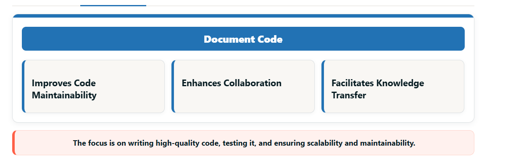

automated testing:
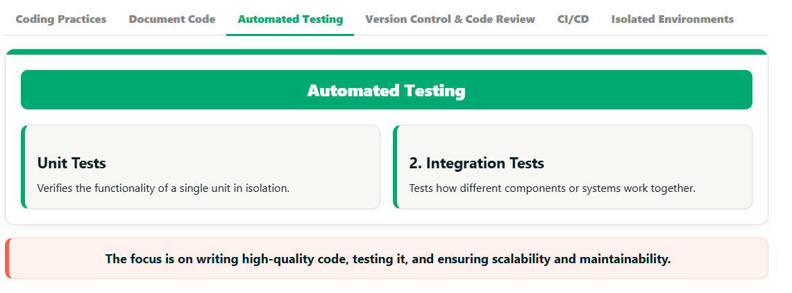

version control and code review:
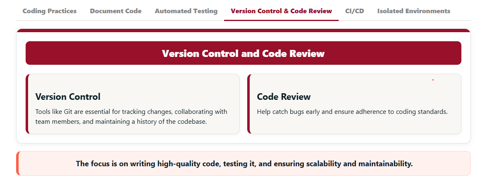

CI/CD:
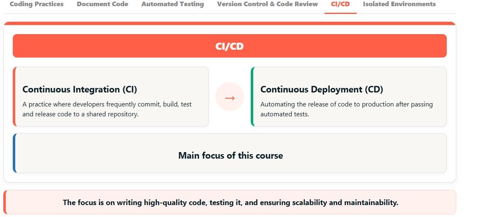

Isolated environments
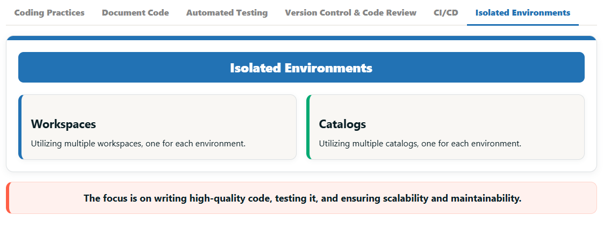

**Coding Practices**

- We will start with some key coding practices that promote better code development.
- First, Code Readability. Write code that’s easy to understand and maintain. Clear, readable code reduces confusion and minimizes the chances of errors when updates or changes are needed.
- Next, utilizing consistent naming conventions. Using descriptive, consistent names for variables, functions, and classes makes your code self-explanatory and enhances collaboration among team members.
- Finally, incorporating modular design in your code base. This means breaking your project down into smaller, reusable components (like functions). This not only makes your code easier to maintain but also allows for smoother scaling as your project grows.
- You can also use code linting tools to help enforce these practices. Linting tools automatically analyze your code for potential errors, inconsistencies, and style violations. While linting tools are outside the scope of this course, they are an excellent resource for improving code quality and maintaining readability.

**Document Code**

- Another important best practice is documenting your code.
- Good documentation improves the following:
    - First the ability to maintain your code. Clear docs help developers understand the purpose and functionality of the code, making updates and bug fixes quicker and easier.
    - Next good documentation improves collaboration. Well-documented code lets team members get up to speed fast, reducing misunderstandings and errors.
    - Lastly documentation improves knowledge transfer. By documenting your code it preserves key info about the code design and structure, ensuring smooth transitions when team members change.

**Automated Testing**

- Testing is an extremely critical component of software development best practices.
- Writing both unit tests and integration tests is essential for verifying that both individual components and their interactions function correctly.
- A unit test verifies the functionality of a single unit or component of code, typically in isolation to ensure it behaves as expected.
- Integration tests, on the other hand, check how different components or systems work together to ensure they function correctly as a whole.

**Version Control and Code Review**

- Another essential best practice is using version control and code reviews on your project.
With version control, tools like Git are essential for tracking changes, collaborating with your team, and keeping a history of your codebase. They allow you to roll back changes, manage multiple versions, and avoid conflicts, all while keeping your work organized and secure.
- Next is Code Reviews. When combined with version control, code reviews are an effective way to catch bugs early, improve code quality, and ensure consistency in coding standards. Code reviews foster collaboration, encourage knowledge sharing within the team, and ultimately lead to more maintainable and reliable code.
- In short, use version control to manage your codebase effectively, and conducting code reviews help to improve the quality of your code through collaboration.

**CI/CD**

- Next is CI/CD, or continuous integration and continuous deployment/delivery.
- At a high level,continuous Integration (CI) is when developers regularly commit code, build, test and release code to a shared repository. The goal is to catch issues early through continuous integration and testing.
- Next is Continuous Deployment (CD). This automates the release of code to production after passing your automated tests (unit and integration tests). The goal is to deliver features and fixes quickly and consistently avoiding errors.
- This course mainly focuses on Continuous Integration within the CI/CD pipeline, with a high level overview of Continuous deployment and delivery.

**Isolated Environments**

- Lastly, you do not want to be modifying code directly on the production codebase.
- Organizations often use different environments for each stage. A typical setup includes “Development & Stage” and “Production,” but this can vary based your organization's processes.
- Separate environments help isolate changes and ensure thorough testing before deployment, preventing issues from mixing development and production.
- In Databricks, you can isolate environments in a few ways:
    - You can use multiple Workspaces, one for each environment.
    - Or, use a single Workspace with multiple catalogs.
- One major advantage of Databricks is Unity Catalog, which provides built-in features like lineage, security, and monitoring, all without needing third-party tools.

This was a quick high level overview of some key software engineering best practices. There are many more that we do not cover here in this overview.

These practices aim to create high-quality, maintainable software that can evolve over time. The focus is on writing efficient, readable, and defect-free code.

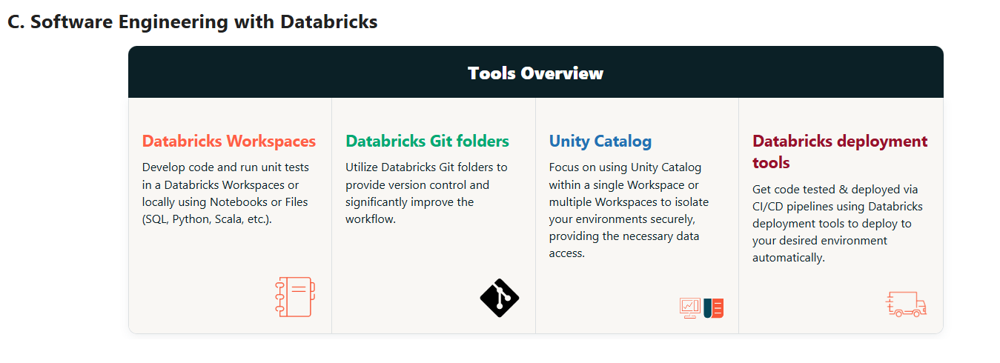

---

# Lecture 2 - Introduction to Modularizing PySpark Code
when you find yourself using unmodular code, look for opportunities to turn into functions and to help with maintenance:
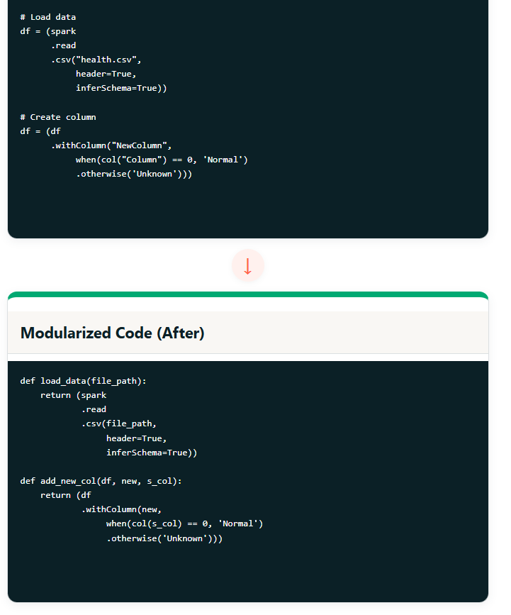

## Demo
- create some catalogs with some csv files
- creates a pipeline with traditional spark
- focus on modularizing

unmodular:
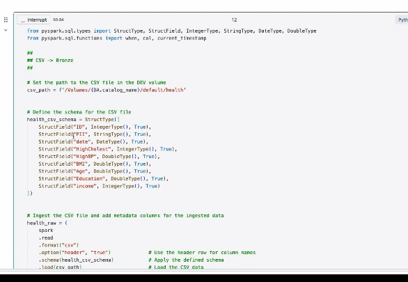

create 5 new functions:
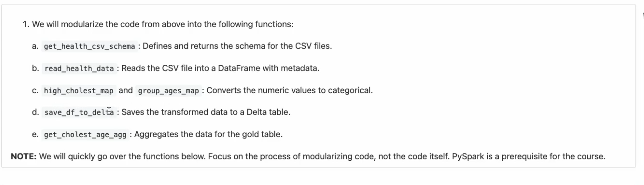

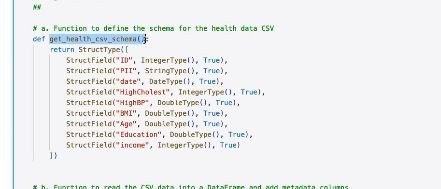

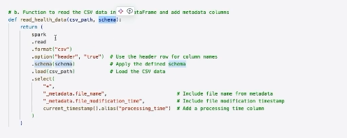

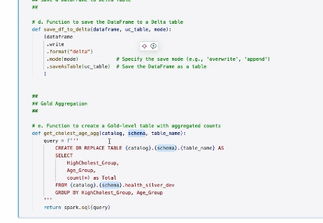

now you can use these functions to perform actions in a much more readable way:
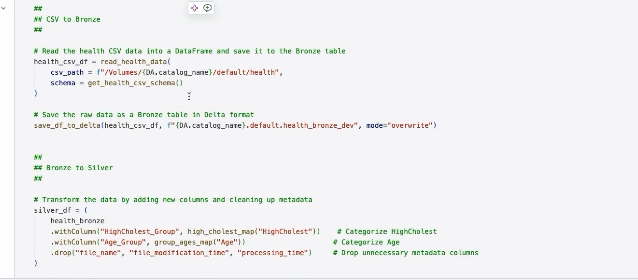

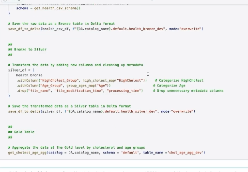

--- 

# Lecture 3 - DevOps Fundamentals
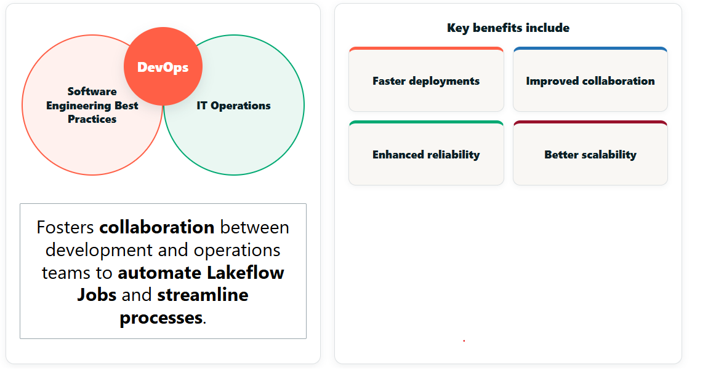

the classic lifecycle:
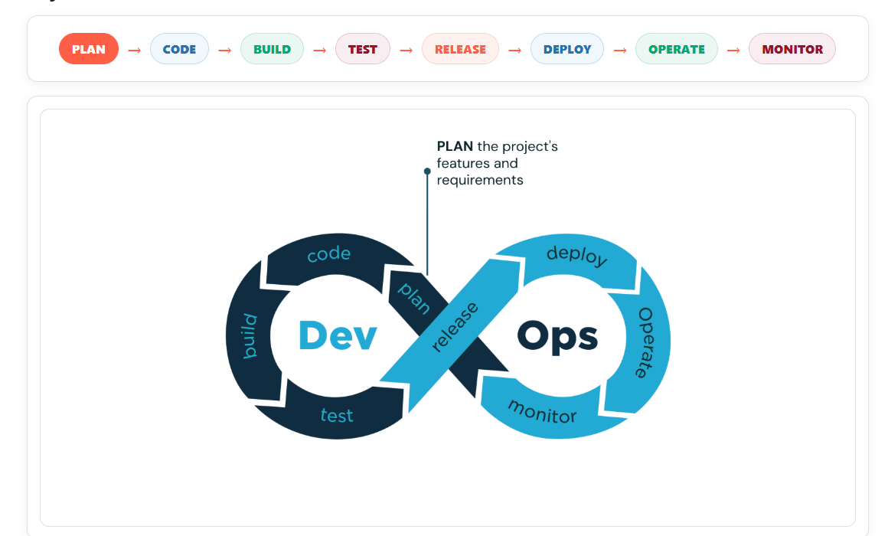

Let’s dive into the 8 key steps of the DevOps lifecycle, breaking each stage down into simple, easy-to-understand points.

First up is Planning. This is where we define project goals, gather requirements, and make sure the whole team is aligned on what needs to be delivered.

Next, we move on to Coding. Here, developers write the application’s source code, building the features and functionality we need.

After that comes Building. This is where we compile the code into executable files, making sure all dependencies are correctly integrated.

Then, we hit Testing. In this stage, we run automated tests to ensure the code works as expected, catching any bugs before we release. Testing is extremely important within DevOps.

Now it’s time for Release. We want to package the application, ensuring it’s production-ready, and prepare for a controlled rollout.

Once the release is ready, we move to Deploying. This is when we push the application to the production environment and make it available to users.

After deployment, we need to Operate the application. This means monitoring the performance, managing its resources, and quickly addressing any issues that come up.

Lastly, we get to Monitoring. Here, we track the app’s performance, gather feedback, and continuously work on improvements to keep things running smoothly.

apply principles to DataOps and MLOps
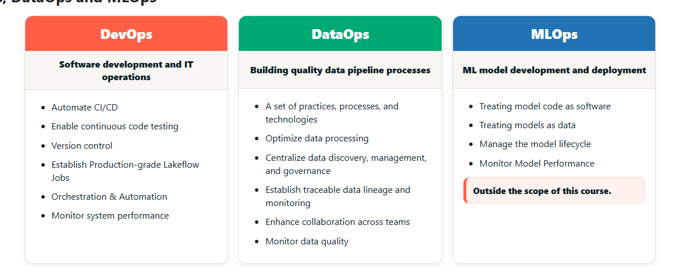

---

# Lecture 4 - The Role of CI and CD in DevOps
CI/CD is a key subset of DevOps practices that focuses on automating code integration, testing, and delivery pipelines, including DataOps pipelines. Within the DevOps lifecycle, continuous integration (CI) emphasizes planning, development, environment management, and testing of the pipelines.

On the other hand, continuous deployment (CD) focuses on automating release processes, deployment, operation, and monitoring of these pipelines.

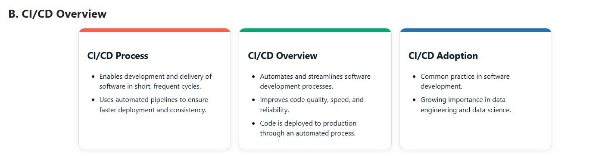

in short - break up tasks and features into small, well-planned chunks that can be delivered in quick turn arounds. develop in isolation to not interfere with other development. test everything and deploy quickly

## Testing
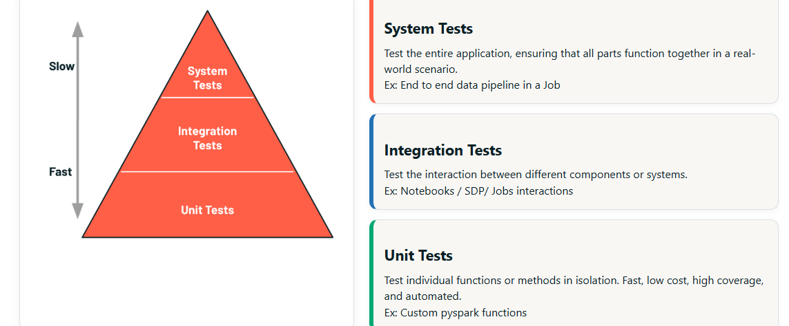

Within CI/CD there are testing steps you should following within what's called the testing pyramid. The testing pyramid categorizes different tests, unit tests, integration tests and system tests.

The base of the pyramid are unit tests which test individual functions or methods in isolation. Since they are small individual functions, they typically can run quickly, frequently and automatically, ensuring that the functions work as expected.

Unit tests form the foundation because they are inexpensive and provide the broadest coverage. For example, testing if a pyspark method works as expected.

Next is integration tests test the interaction between different components or systems. These are typically slower and more costly than unit tests, but provide greater assurance that components work together correctly. Within Databricks these typically will revolve around using Notebooks, SDP and or Lakeflow Jobs. For example, testing whether a pyspark method and SDP work correctly.

Lastly system tests test the entire application, ensuring that all parts function together in a real-world scenario. These are typically slow, costly, and often run in a production-like environment. For example, for our end to end data pipeline, testing whether the data pipeline works as expected within a Job, creating our desired results.

## Continuous Delivery and Deployment
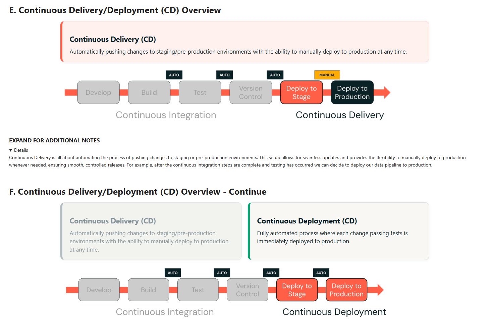

---

# Lecture 5 - Planning the Project
first gather requirements:
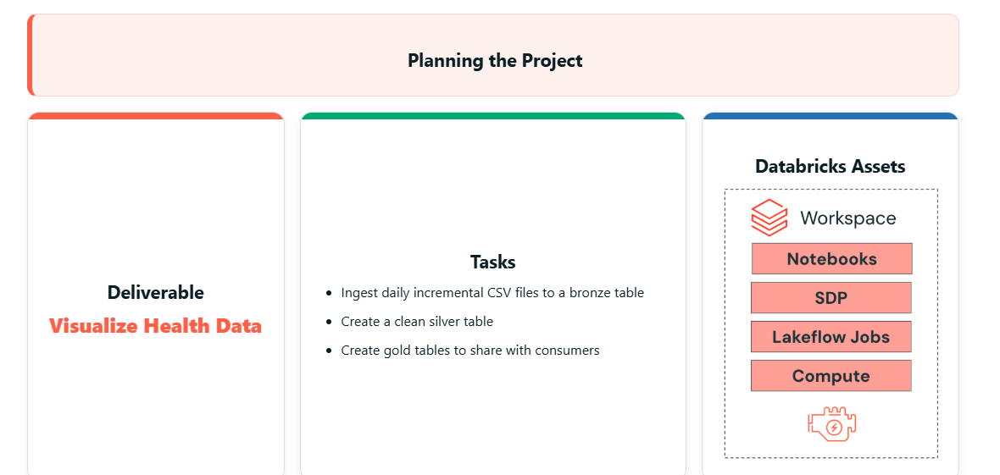

Plan and setup your environments:
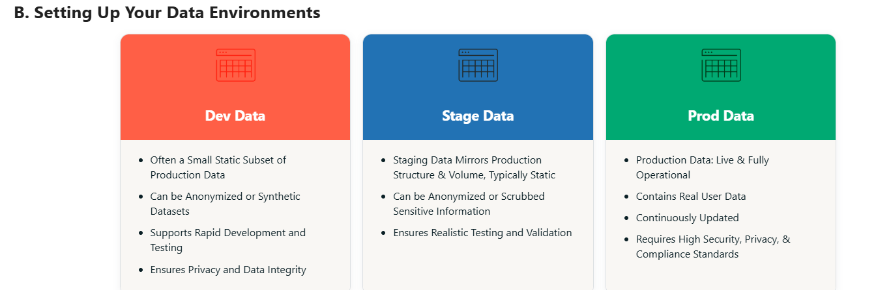

Isolate your work with workspaces and catalogs
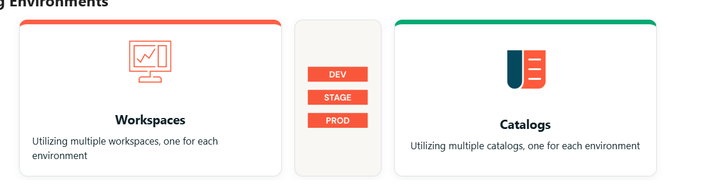
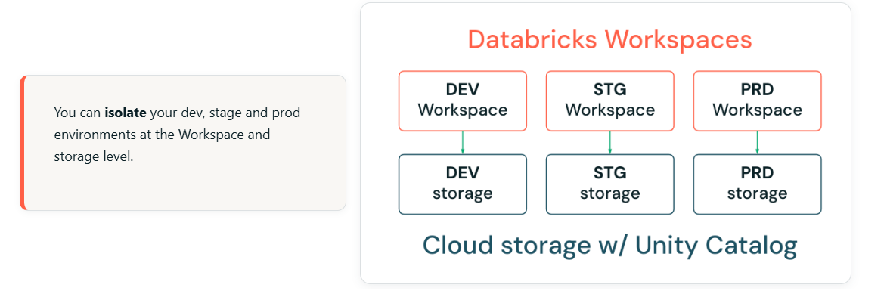

project architecture for the course:
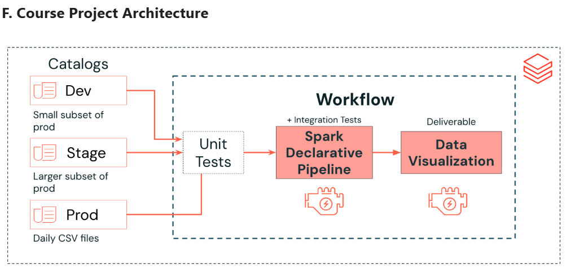

---

# Lecture 6 - Intro to Unit Tests for PySpark
- unit tests are the foundation. 
- pyspark.testing.utils provides helper functions to make unit testing easier: https://spark.apache.org/docs/latest/api/python/reference/pyspark.testing.html
- two common tests are assertDataFrameEqual and assertSchemaEqual
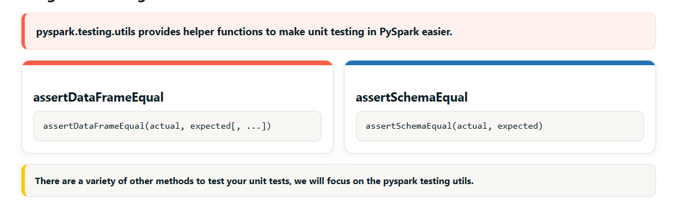

pytest framework:
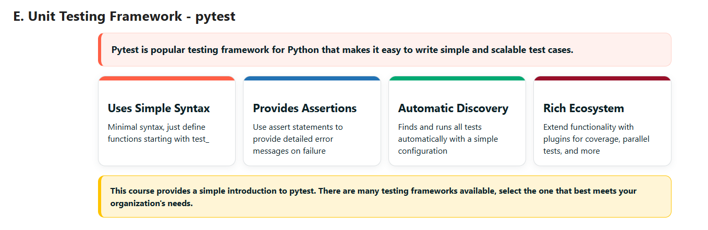

fixtures help modularize testing

running pytest in databricks can be pointed to run at any $test$ files:
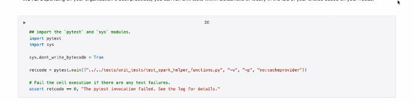

pytest.ini configures pytest on your env:
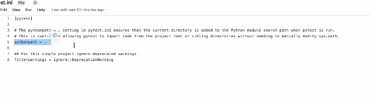

---

# Lecture 7 - Executing Integration Tests with SDP and Jobs